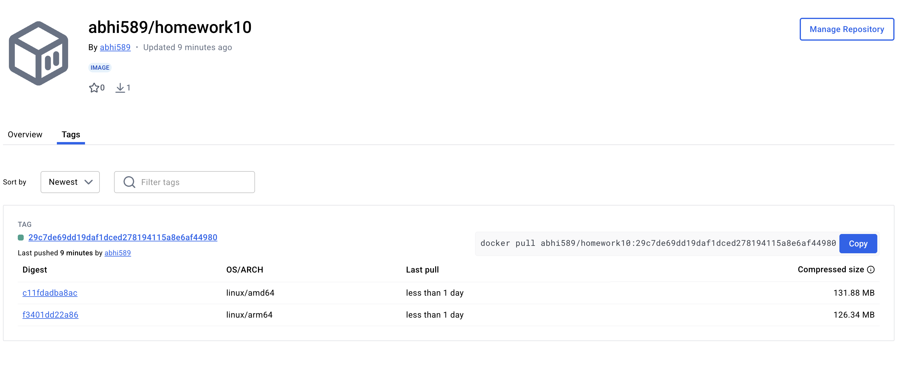
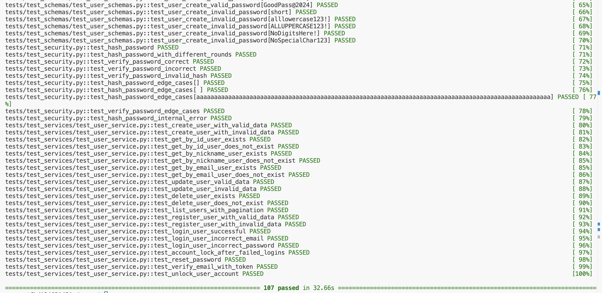

# Event Manager Assignment

Welcome to the **Event Manager**!  The goal was to contribute to the development of a secure, robust REST API with JWT OAuth2 authentication, manual and automated testing, and robust issue resolution.

---

## 🔧 Assignment Objectives Fulfilled

- ✅ Familiarized with FastAPI REST API and authentication mechanisms
- ✅ Refined and added schema validations for usernames, passwords, and profile fields
- ✅ Implemented test cases to raise overall test coverage (~95%)
- ✅ Debugged and fixed various real-world edge case issues
- ✅ Worked collaboratively using GitHub issues, pull requests, and branching

---

## 🔍 Issues Addressed

| Issue Number | Title                                               | Description                                                                 |
|--------------|-----------------------------------------------------|-----------------------------------------------------------------------------|
| [#1](https://github.com/AbhishekDuddupudi/event_manager_10/issues/1)  | Mismatched data during Login - Authentication                            | require authenticated access failed due to missing token fixtures   
| [#3](https://github.com/AbhishekDuddupudi/event_manager_10/issues/3)  | Username Validation                              | Validates username alias field and email format                           |
| [#5](https://github.com/AbhishekDuddupudi/event_manager_10/issues/5)  | Password Validation                              | Enforces strong password rules with regex                                 |
| [#7](https://github.com/AbhishekDuddupudi/event_manager_10/issues/7)  | Profile Picture URL Validation                   | Adds validation for valid and secure image URLs                           |
| [#9](https://github.com/AbhishekDuddupudi/event_manager_10/issues/9)  | Profile Field Edge Cases                         | Handles combinations of bio, picture updates with validation              |
| [#11](https://github.com/AbhishekDuddupudi/event_manager_10/issues/11)| Unique Nickname in User Fixture needed           | Ensures deterministic nickname generation for test stability              |
| [#13](https://github.com/AbhishekDuddupudi/event_manager_10/issues/13)| Docker Scan Image Failure                        | Docker scan vulnerability issue resolved                                  |

---

## 🐳 Docker and Test Logs

- **Docker Image Reference Screenshot**  


- **Test Run Screenshot (Pytest)**  


---

## 🧪 Testing Details

- Run tests with:
  ```bash
  docker-compose exec fastapi bash
  pytest
  ```
- Coverage exceeds **90%**, including:
  - API behavior
  - Schema validation
  - JWT login/logout and auth
  - Profile update edge cases

---

## 🔄 API & Database Access

- **API Docs (Swagger)**: http://localhost/docs  
- **Database (PGAdmin)**: http://localhost:5050  

---

## 📖 Technologies Used

- **FastAPI** for API logic
- **Pydantic** for schema validation
- **SQLAlchemy** + **Alembic** for ORM and migrations
- **Pytest** for unit/integration testing
- **Docker Compose** for containerization
- **GitHub Projects & Issues** for collaboration

---

## 🧠 Reflection

This assignment was a great learning experience in working with a production-grade API. I understood how to integrate data validation deeply with schema models using Pydantic, and how to identify and isolate issues using FastAPI's modular service structure.

I also got hands-on with Docker and database migrations through Alembic. Writing and maintaining a clean test suite using pytest gave me confidence in managing future QA work with best practices. The most valuable aspect was collaborating via GitHub – working with branches, opening issues, and writing meaningful commit messages made the workflow professional and traceable.

---

## 🚀 How to Run

```bash
git clone https://github.com/AbhishekDuddupudi/event_manager_10.git
cd event_manager_10
docker-compose up --build -d
```

Visit the docs at: http://localhost/docs  
Log into PGAdmin at: http://localhost:5050

---

## ✅ Submission Summary

- [x] 5 Issues Documented and Fixed
- [x] Tests Updated and Passed
- [x] GitHub Issues, Branches, PRs Used
- [x] This Updated README

---

Happy coding! 🎉
